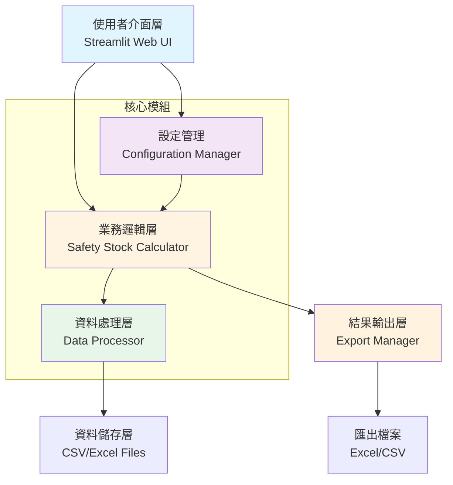
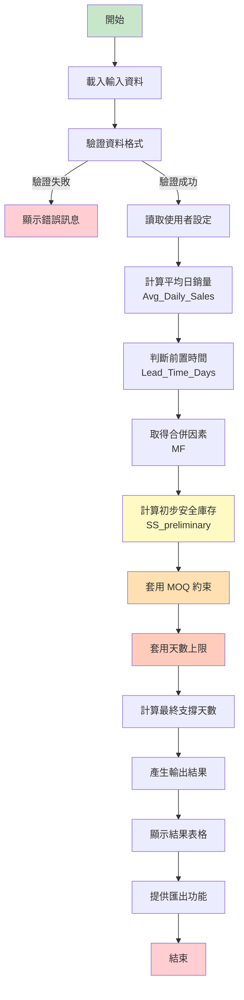

# 安全(緩衝)庫存計算機 - 完整技術文件

## 專案概述

**專案名稱**: Safety(Buffer) Stock Calculation v1.0  
**技術堆疊**: Python 3.11 + Streamlit  
**部署方式**: 本地運行 / Docker 容器化  
**資料輸入**: CSV/Excel 檔案上傳  
**主要功能**: 根據銷量資料和商業約束計算安全庫存建議值

## 系統架構

### 整體架構圖



### 專案目錄結構

```
Kilo Safety Stock Calculate/
├── app.py                          # Streamlit 主應用程式
├── requirements.txt                # Python 套件依賴
├── README.md                       # 專案說明文件
├── Dockerfile                      # Docker 容器化設定
├── docker-compose.yml              # Docker Compose 設定
├── config/
│   ├── __init__.py
│   └── settings.py                 # 系統設定管理
├── core/
│   ├── __init__.py
│   ├── calculator.py               # 核心計算邏輯
│   ├── data_processor.py           # 資料處理
│   └── constants.py                # 常數定義（MF 表等）
├── ui/
│   ├── __init__.py
│   ├── pages/                     # Streamlit 頁面
│   └── components/                # UI 元件
├── utils/
│   ├── __init__.py
│   ├── validators.py               # 資料驗證
│   └── exporters.py                # 匯出功能
├── data/
│   ├── input/                     # 輸入資料範例
│   │   └── sample_input.csv
│   └── output/                    # 輸出資料目錄
├── tests/
│   ├── __init__.py
│   └── test_column_mapping.py     # 測試檔案
└── plans/                         # 專案計劃文件
```

## 核心計算邏輯

### 計算流程圖



### 計算公式

1. **平均日銷量**: `Avg_Daily_Sales = (Last Month Sold Qty + Last 2 Month Sold Qty) / 60`

2. **前置時間**:
   - Supply Source = "1" 或 "4" → 7 天（行貨）
   - Supply Source = "2" → 3 天（倉貨）
   - 其他 → 7 天（預設）

3. **合併因素 MF**: 依 Shop Class 查表
   - AA: 2.58 (99.5%)
   - A1: 2.33 (99.0%)
   - A2: 2.05 (98.0%)
   - A3: 1.88 (97.0%)
   - B1: 1.75 (96.0%)
   - B2: 1.645 (95.0%)
   - C1: 1.555 (94.0%)
   - C2: 1.48 (93.0%)
   - D1: 1.28 (90.0%)

4. **初步安全庫存**: `SS_preliminary = Avg_Daily_Sales × √Lead_Time_Days × MF`

5. **MOQ 約束**:
   - 乘數模式: `SS_after_MOQ = max(SS_preliminary, MOQ × multiplier)`
   - 加 1 模式: `SS_after_MOQ = max(SS_preliminary, MOQ + 1)`

6. **天數上限**: `Suggested_Safety_Stock = max(SS_after_MOQ, Avg_Daily_Sales × User_Max_Days)`

7. **支撐天數**: `Safety_Stock_Days = Suggested_Safety_Stock / Avg_Daily_Sales`

## API 說明

### 核心模組 API

#### Settings 類別 (`config/settings.py`)

```python
class Settings:
    def __init__(
        self,
        max_safety_stock_days: int = 7,
        moq_multiplier: float = 1.25,
        moq_constraint_mode: str = "multiplier",
        shop_class_max_days: Optional[Dict[str, int]] = None
    )

    def get_max_days_for_shop_class(self, shop_class: str) -> int
    def to_dict(self) -> Dict[str, Any]
    def from_dict(cls, data: Dict[str, Any]) -> 'Settings'
    def save_to_file(self, file_path: str)
    def load_from_file(cls, file_path: str) -> 'Settings'
```

#### SafetyStockCalculator 類別 (`core/calculator.py`)

```python
class SafetyStockCalculator:
    def __init__(self, settings: Settings)

    def calculate_avg_daily_sales(
        self,
        last_month_qty: float,
        last_2_month_qty: float
    ) -> float

    def determine_lead_time(self, supply_source: str) -> int

    def get_merge_factor(self, shop_class: str) -> Dict[str, float]

    def calculate_preliminary_ss(
        self,
        avg_daily_sales: float,
        lead_time: int,
        mf: float
    ) -> float

    def apply_moq_constraint(
        self,
        preliminary_ss: float,
        moq: float,
        multiplier: float,
        mode: str
    ) -> Tuple[float, bool]

    def apply_max_days_constraint(
        self,
        ss_after_moq: float,
        avg_daily_sales: float,
        max_days: int
    ) -> Tuple[int, bool]

    def calculate_safety_stock_days(
        self,
        suggested_ss: float,
        avg_daily_sales: float
    ) -> float

    def calculate_safety_stock(
        self,
        article: str,
        site: str,
        shop_class: str,
        last_month_qty: float,
        last_2_month_qty: float,
        supply_source: str,
        moq: float,
        original_safety_stock: Optional[float] = None,
        mtd_sold_qty: Optional[float] = None,
        product_hierarchy: Optional[str] = None,
        article_description: Optional[str] = None,
        rp_type: Optional[str] = None
    ) -> Dict[str, Any]
```

#### DataProcessor 類別 (`core/data_processor.py`)

```python
class DataProcessor:
    @staticmethod
    def normalize_column_names(df: pd.DataFrame) -> pd.DataFrame

    @staticmethod
    def load_data(file_path: str) -> pd.DataFrame

    @staticmethod
    def validate_required_columns(df: pd.DataFrame) -> bool

    @staticmethod
    def get_missing_columns(df: pd.DataFrame) -> List[str]

    @staticmethod
    def clean_data(df: pd.DataFrame) -> pd.DataFrame

    @staticmethod
    def prepare_calculation_data(df: pd.DataFrame) -> List[Dict[str, Any]]

    @staticmethod
    def get_data_summary(df: pd.DataFrame) -> Dict[str, Any]
```

### 工具模組 API

#### 驗證器 (`utils/validators.py`)

```python
def validate_numeric_value(
    value: Any,
    field_name: str,
    min_value: float = 0,
    allow_zero: bool = True
) -> Tuple[bool, str]

def validate_shop_class(shop_class: str) -> Tuple[bool, str]

def validate_supply_source(supply_source: str) -> Tuple[bool, str]

def validate_settings(settings: Settings) -> Tuple[bool, str]

def validate_record(record: Dict[str, Any]) -> Tuple[bool, str]
```

#### 匯出器 (`utils/exporters.py`)

```python
def export_to_excel(df: pd.DataFrame, output_path: str) -> bool

def export_to_csv(df: pd.DataFrame, output_path: str) -> bool
```

## 資料格式說明

### 輸入資料格式

必須包含以下欄位：

| 欄位名稱 | 說明 | 範例 | 必要性 |
|---------|------|------|--------|
| Article | 商品編號 | ART001 | 必須 |
| Site | 門市代碼 | S001 | 必須 |
| Class | 店舖等級 | AA, A1, A2, A3, B1, B2, C1, C2, D1 | 必須 |
| Last Month Sold Qty | 上個月銷量 | 120 | 必須 |
| Last 2 Month Sold Qty | 前兩個月銷量總和 | 240 | 必須 |
| Supply Source | 供應來源代碼 | 1, 2, 4 | 必須 |
| MOQ | 最小訂購量 | 10 | 必須 |
| Original_Safety_Stock | 原始安全庫存 | 50 | 可選 |
| MTD_Sold_Qty | 本月至今銷量 | 30 | 可選 |
| Product Hierarchy | 產品階層 | CATEGORY_A | 可選 |
| Article Description | 商品描述 | Product Name | 可選 |
| RP Type | RP 類型 | TYPE_A | 可選 |

### 輸出資料格式

計算結果包含以下欄位：

| 欄位名稱 | 說明 | 類型 |
|---------|------|------|
| Article | 商品編號 | string |
| Site | 門市代碼 | string |
| Class | 店舖等級 | string |
| RP Type | RP 類型 | string |
| Product Hierarchy | 產品階層 | string |
| Article Description | 商品描述 | string |
| Original_Safety_Stock | 原始安全庫存 | float |
| Original_Safety_Stock_Days | 原始安全庫存天數 | float |
| MTD_Sold_Qty | 本月至今銷量 | float |
| Last_Month_Sold_Qty | 上個月銷量 | float |
| Last_2_Month_Sold_Qty | 前兩個月銷量總和 | float |
| Avg_Daily_Sales | 平均日銷量 | float |
| Lead_Time_Days | 前置時間（天數） | int |
| MF_Used | 使用的合併因素 | float |
| MF_Service_Level | 服務水準（%） | float |
| Preliminary_SS | 初步安全庫存 | float |
| SS_after_MOQ | 套用 MOQ 約束後的安全庫存 | float |
| User_Max_Days_Applied | 應用的天數上限 | int |
| Suggested_Safety_Stock | 建議安全庫存（最終值） | int |
| Constraint_Applied | 約束類型（MOQ / 天數上限 / 兩者 / 無） | string |
| Safety_Stock_Days | 最終值可支撐天數 | float |
| Preliminary_SS_Days | 初步安全庫存天數 | float |
| SS_after_MOQ_Days | MOQ後安全庫存天數 | float |
| Suggested_SS_Days | 建議安全庫存天數 | float |
| Notes | 計算過程說明 | string |

## 設定參數說明

### 全域設定

| 參數 | 預設值 | 範圍 | 說明 |
|------|--------|------|------|
| max_safety_stock_days | 7 | 3-21 | 安全庫存天數上限 |
| moq_multiplier | 1.25 | > 0 | MOQ 約束乘數 |
| moq_constraint_mode | "multiplier" | "multiplier"/"add_one" | MOQ 約束模式 |

### Shop Class 設定

可以為不同的 Shop Class 設定不同的天數上限：

| Shop Class | 預設天數上限 | 可設定範圍 |
|-----------|-------------|-----------|
| AA | 7 | 3-21 |
| A1 | 7 | 3-21 |
| A2 | 7 | 3-21 |
| A3 | 7 | 3-21 |
| B1 | 7 | 3-21 |
| B2 | 7 | 3-21 |
| C1 | 7 | 3-21 |
| C2 | 7 | 3-21 |
| D1 | 7 | 3-21 |

## 部署與運行

### 本地運行

```bash
# 1. 安裝依賴
pip install -r requirements.txt

# 2. 運行應用
streamlit run app.py
```

### Docker 運行

```bash
# 1. 建置映像
docker build -t safety-stock-calculator .

# 2. 運行容器
docker run -p 8501:8501 -v $(pwd)/data:/app/data safety-stock-calculator
```

### Docker Compose

```bash
docker-compose up --build
```

## 測試說明

### 單元測試

```bash
# 運行所有測試
pytest tests/ -v --cov=core --cov=utils

# 運行特定測試
pytest tests/test_column_mapping.py -v
```

### 測試覆蓋範圍

- 核心計算邏輯測試
- 資料處理功能測試
- 欄位名稱映射測試
- 設定驗證測試

## 擴展開發指南

### 新增計算邏輯

1. 在 `core/constants.py` 中定義新常數
2. 在 `core/calculator.py` 中實作計算方法
3. 在 `core/calculator.py` 的 `calculate_safety_stock` 方法中整合
4. 更新輸出欄位定義
5. 編寫對應測試

### 新增輸入欄位

1. 在 `core/constants.py` 中定義欄位常數
2. 在 `COLUMN_NAME_ALIASES` 中添加映射
3. 在 `core/data_processor.py` 中處理新欄位
4. 在 `core/calculator.py` 中使用新欄位
5. 更新驗證邏輯

### 新增匯出格式

1. 在 `utils/exporters.py` 中實作新匯出函數
2. 在 `app.py` 中添加對應的下載按鈕
3. 更新 UI 介面

## 常見問題與故障排除

### 資料載入問題

**問題**: 上傳檔案時顯示缺少必要欄位
**解決方案**:
1. 檢查欄位名稱是否正確（支援大小寫變體）
2. 確認檔案格式為 CSV 或 Excel
3. 檢查資料是否有空值

### 計算結果異常

**問題**: 計算結果不合理
**解決方案**:
1. 檢查輸入資料的數值範圍
2. 驗證 Shop Class 是否有效
3. 檢查設定參數是否合理

### 效能問題

**問題**: 大檔案處理緩慢
**解決方案**:
1. 檢查資料是否有異常值
2. 考慮分批處理大檔案
3. 優化計算邏輯

## 版本歷史

### v1.0 (當前版本)
- 基礎安全庫存計算功能
- 支援 CSV/Excel 輸入
- MOQ 約束和天數上限
- Excel/CSV 匯出
- Docker 容器化支援
- 欄位名稱自動映射

## 未來擴展方向

### 短期擴展（v1.1）
- 支援按 Shop Class 設定不同的天數上限
- 加入計算歷史紀錄功能
- 提供更多匯出格式（PDF、JSON）
- 加入資料視覺化圖表

### 中期擴展（v2.0）
- 引入銷量標準差計算
- 加入季節性/促銷調整係數
- 支援資料庫連接（MySQL、PostgreSQL）
- 加入排程自動計算功能

### 長期擴展（v3.0）
- 結合現有庫存與在途量
- 支援多層級天數上限設定
- 加入機器學習模型預測銷量
- 提供多使用者權限管理

---

**注意**: 本文件適用於 Safety(Buffer) Stock Calculation v1.0。如有更新，請參考最新版本的文件。