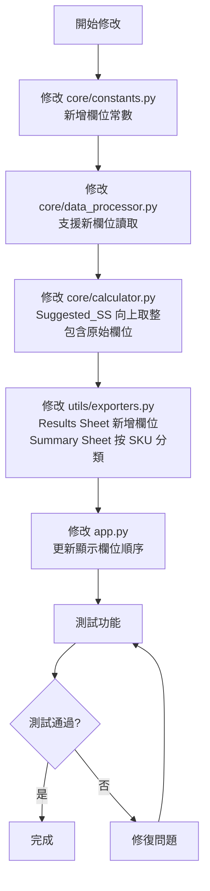

# Excel 輸出修改計畫

## 概述
修改安全庫存計算系統的 Excel 輸出格式，新增欄位並調整 Summary Sheet 的分類方式。

## 需求分析

### Results Sheet 修改
1. **新增欄位：原有的 Safety Qty**
   - 顯示輸入資料中的原始 Safety Stock 數量
   - 欄位名稱：`Original_Safety_Stock`

2. **修改欄位：Suggested_Safety_Stock**
   - 改為顯示整數（向上取整）
   - 使用 `math.ceil()` 函數

3. **新增欄位：MTD Sold Qty**
   - 顯示本月至今銷量
   - 欄位名稱：`MTD_Sold_Qty`

4. **新增欄位：Last Month Sold Qty**
   - 顯示上個月銷量
   - 欄位名稱：`Last_Month_Sold_Qty`

5. **新增欄位：Last 2 Month Sold Qty**
   - 顯示前兩個月銷量總和
   - 欄位名稱：`Last_2_Month_Sold_Qty`

### Summary Sheet 修改
1. **新增按 SKU (Article) 分類**
   - 因為一個資料檔案可能包含多個 SKU
   - 統計每個 SKU 的相關資訊

## 修改項目清單

### 1. core/constants.py
**修改內容：**
- 新增欄位常數定義
- 新增欄位名稱映射別名

**新增常數：**
```python
# 原始輸入欄位
FIELD_ORIGINAL_SAFETY_STOCK = "Original_Safety_Stock"
FIELD_MTD_SOLD_QTY = "MTD_Sold_Qty"
FIELD_LAST_MONTH_SOLD_QTY = "Last_Month_Sold_Qty"
FIELD_LAST_2_MONTH_SOLD_QTY = "Last_2_Month_Sold_Qty"

# 更新必要輸入欄位（可選欄位）
OPTIONAL_INPUT_FIELDS = [
    "Safety Stock",
    "MTD Sold Qty"
]
```

**新增欄位名稱映射：**
```python
COLUMN_NAME_ALIASES: Dict[str, str] = {
    # Safety Stock 的變體
    "Safety Stock": FIELD_ORIGINAL_SAFETY_STOCK,
    "Safety stock": FIELD_ORIGINAL_SAFETY_STOCK,
    "safety stock": FIELD_ORIGINAL_SAFETY_STOCK,
    
    # MTD Sold Qty 的變體
    "MTD Sold Qty": FIELD_MTD_SOLD_QTY,
    "MTD sold qty": FIELD_MTD_SOLD_QTY,
    "mtd sold qty": FIELD_MTD_SOLD_QTY,
    
    # Last Month Sold Qty 的變體
    "Last Month Sold Qty": FIELD_LAST_MONTH_SOLD_QTY,
    "Last month sold qty": FIELD_LAST_MONTH_SOLD_QTY,
    "last month sold qty": FIELD_LAST_MONTH_SOLD_QTY,
    
    # Last 2 Month 的變體
    "Last 2 Month": FIELD_LAST_2_MONTH_SOLD_QTY,
    "Last 2 Month Sold Qty": FIELD_LAST_2_MONTH_SOLD_QTY,
    "last 2 month": FIELD_LAST_2_MONTH_SOLD_QTY,
}
```

### 2. core/data_processor.py
**修改內容：**
- 更新 `REQUIRED_INPUT_FIELDS` 以包含新欄位（作為可選欄位）
- 修改 `clean_data()` 方法以處理新欄位
- 修改 `prepare_calculation_data()` 方法以包含新欄位

**修改點：**
1. 新增可選欄位常數引用
2. 在 `clean_data()` 中新增對新欄位的數值轉換
3. 在 `prepare_calculation_data()` 中包含新欄位到輸出字典

### 3. core/calculator.py
**修改內容：**
- 修改 `calculate_safety_stock()` 方法返回值
- Suggested_Safety_Stock 改為向上取整
- 在返回字典中包含原始輸入欄位

**修改點：**
1. 在方法簽名中新增參數：`original_safety_stock`, `mtd_sold_qty`
2. 使用 `math.ceil()` 對 `suggested_ss` 向上取整
3. 在返回字典中新增：
   - `FIELD_ORIGINAL_SAFETY_STOCK`: original_safety_stock
   - `FIELD_MTD_SOLD_QTY`: mtd_sold_qty
   - `FIELD_LAST_MONTH_SOLD_QTY`: last_month_qty
   - `FIELD_LAST_2_MONTH_SOLD_QTY`: last_2_month_qty

### 4. utils/exporters.py
**修改內容：**
- Results Sheet：調整欄位順序，新增欄位
- Summary Sheet：新增按 SKU 分類的統計

**Results Sheet 欄位順序：**
```python
display_columns = [
    'Article', 'Site', 'Class',
    'Original_Safety_Stock',  # 新增
    'MTD_Sold_Qty',            # 新增
    'Last_Month_Sold_Qty',     # 新增
    'Last_2_Month_Sold_Qty',   # 新增
    'Avg_Daily_Sales',
    'Lead_Time_Days',
    'MF_Used', 'MF_Service_Level',
    'Preliminary_SS', 'SS_after_MOQ',
    'User_Max_Days_Applied',
    'Suggested_Safety_Stock',  # 修改為整數
    'Constraint_Applied',
    'Safety_Stock_Days'
]
```

**Summary Sheet 新增內容：**
```python
# 按 SKU 分類統計
sku_summary = df.groupby('Article').agg({
    'Site': 'count',
    'Original_Safety_Stock': 'sum',
    'MTD_Sold_Qty': 'sum',
    'Last_Month_Sold_Qty': 'sum',
    'Last_2_Month_Sold_Qty': 'sum',
    'Suggested_Safety_Stock': 'sum',
    'Safety_Stock_Days': 'mean'
}).reset_index()
sku_summary.columns = [
    'SKU (Article)',
    '門市數量',
    '原始安全庫存總和',
    'MTD銷量總和',
    '上月銷量總和',
    '前兩月銷量總和',
    '建議安全庫存總和',
    '平均支撐天數'
]
```

### 5. app.py
**修改內容：**
- 更新 `display_results_summary()` 中的欄位顯示順序
- 更新 `display_download_buttons()` 中的 Excel 生成邏輯

**修改點：**
1. 更新 `display_columns` 列表以包含新欄位
2. 更新 Excel 匯出中的 Summary Sheet 生成邏輯

## 實作流程圖



## 測試計畫

1. **單元測試**
   - 測試新欄位常數定義
   - 測試欄位名稱映射
   - 測試向上取整功能

2. **整合測試**
   - 使用實際輸入檔案測試完整流程
   - 驗證 Results Sheet 欄位順序和內容
   - 驗證 Summary Sheet SKU 分類統計

3. **驗收測試**
   - 確認 Suggested_Safety_Stock 為整數
   - 確認所有新欄位正確顯示
   - 確認 Summary Sheet 按 SKU 正確分類

## 風險評估

| 風險項目 | 影響程度 | 緩解措施 |
|---------|---------|---------|
| 輸入檔案欄位名稱不一致 | 中 | 使用欄位名稱映射處理變體 |
| 向上取整可能影響計算結果 | 低 | 這是需求要求的行為 |
| Summary Sheet 統計邏輯複雜度 | 中 | 使用 pandas groupby 簡化 |
| 向後相容性 | 中 | 新欄位設為可選，不影響現有功能 |

## 備註

- 所有修改都保持向後相容性
- 新增欄位在輸入檔案中為可選
- Suggested_Safety_Stock 向上取整是需求要求的行為
- Summary Sheet 的 SKU 分類統計提供更詳細的分析視角
