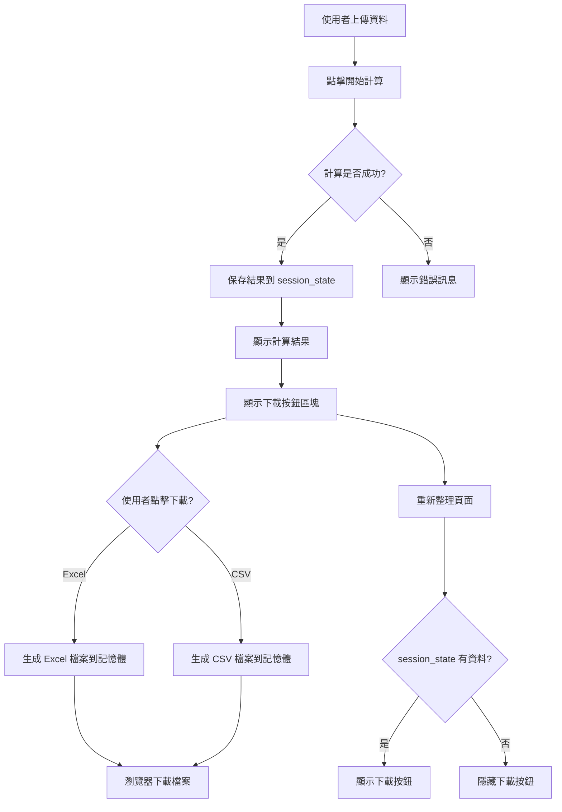
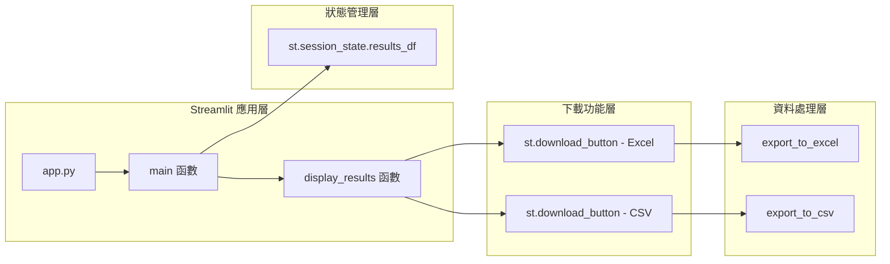

# 匯出Excel問題 - 實施方案

## 解決方案架構

### 系統流程圖



### 模組架構



## 實施步驟

### 步驟 1：修改 app.py - 初始化 Session State

**位置：** [`app.py`](../app.py) 第 331-372 行的 `main()` 函數

**修改內容：**

```python
def main():
    """主程式"""
    # 初始化 session state
    if 'results_df' not in st.session_state:
        st.session_state.results_df = None
    if 'calculation_timestamp' not in st.session_state:
        st.session_state.calculation_timestamp = None
    
    # 載入設定
    settings = load_settings()
    
    # ... 其餘程式碼保持不變
```

### 步驟 2：修改 app.py - 保存計算結果到 Session State

**位置：** [`app.py`](../app.py) 第 362-368 行

**修改內容：**

```python
# 計算按鈕
if st.button("🚀 開始計算", type="primary", use_container_width=True):
    with st.spinner("正在計算中..."):
        results_df = calculate_safety_stock(df, settings)
        
        if len(results_df) > 0:
            # 保存到 session state
            st.session_state.results_df = results_df
            st.session_state.calculation_timestamp = pd.Timestamp.now()
            
            st.success(f"✅ 計算完成！共處理 {len(results_df)} 筆記錄")
            display_results(results_df)
```

### 步驟 3：修改 app.py - 重構 display_results 函數

**位置：** [`app.py`](../app.py) 第 217-288 行

**修改內容：**

將 display_results 函數拆分為兩個函數：
1. `display_results_summary()` - 顯示結果摘要和表格
2. `display_download_buttons()` - 顯示下載按鈕（獨立於計算流程）

```python
def display_results_summary(results_df: pd.DataFrame):
    """
    顯示計算結果摘要和表格
    
    參數:
        results_df: 包含計算結果的 DataFrame
    """
    st.subheader("📊 計算結果")
    
    # 顯示統計摘要
    col1, col2, col3, col4 = st.columns(4)
    with col1:
        st.metric("總記錄數", len(results_df))
    with col2:
        moq_count = (results_df['Constraint_Applied'] == 'MOQ').sum()
        st.metric("觸發 MOQ 約束", moq_count)
    with col3:
        max_days_count = (results_df['Constraint_Applied'] == '天數上限').sum()
        st.metric("觸發天數上限", max_days_count)
    with col4:
        avg_days = results_df['Safety_Stock_Days'].mean()
        st.metric("平均支撐天數", f"{avg_days:.2f}")
    
    st.markdown("---")
    
    # 顯示結果表格
    st.markdown("### 詳細結果")
    
    # 定義欄位顯示順序
    display_columns = [
        'Article', 'Site', 'Class',
        'Avg_Daily_Sales', 'Lead_Time_Days',
        'MF_Used', 'MF_Service_Level',
        'Preliminary_SS', 'SS_after_MOQ',
        'User_Max_Days_Applied', 'Suggested_Safety_Stock',
        'Constraint_Applied', 'Safety_Stock_Days'
    ]
    
    # 重新排列欄位
    results_df = results_df[display_columns]
    
    # 顯示可編輯的表格
    st.dataframe(
        results_df,
        use_container_width=True,
        height=400
    )
    
    # 高亮顯示約束記錄
    st.markdown("---")
    st.markdown("### 約束記錄分析")
    
    constraint_types = results_df['Constraint_Applied'].value_counts()
    if len(constraint_types) > 0:
        st.bar_chart(constraint_types)


def display_download_buttons(results_df: pd.DataFrame):
    """
    顯示下載按鈕
    
    參數:
        results_df: 包含計算結果的 DataFrame
    """
    st.markdown("---")
    st.subheader("💾 匯出結果")
    
    # Excel 匯出
    try:
        excel_buffer = io.BytesIO()
        with pd.ExcelWriter(excel_buffer, engine='openpyxl') as writer:
            # 結果工作表
            results_df.to_excel(writer, sheet_name='Results', index=False)
            
            # 統計摘要工作表
            summary_data = {
                "項目": [
                    "總記錄數",
                    "觸發 MOQ 約束記錄數",
                    "觸發天數上限記錄數",
                    "平均支撐天數"
                ],
                "數值": [
                    len(results_df),
                    (results_df['Constraint_Applied'] == 'MOQ').sum(),
                    (results_df['Constraint_Applied'] == '天數上限').sum(),
                    results_df['Safety_Stock_Days'].mean()
                ]
            }
            summary_df = pd.DataFrame(summary_data)
            summary_df.to_excel(writer, sheet_name='Summary', index=False)
        
        excel_buffer.seek(0)
        
        col1, col2 = st.columns(2)
        with col1:
            st.download_button(
                label="📊 下載 Excel 檔案",
                data=excel_buffer,
                file_name=f"safety_stock_results_{pd.Timestamp.now().strftime('%Y%m%d_%H%M%S')}.xlsx",
                mime="application/vnd.openxmlformats-officedocument.spreadsheetml.sheet",
                use_container_width=True
            )
        
        # CSV 匯出
        csv_buffer = io.StringIO()
        results_df.to_csv(csv_buffer, index=False, encoding='utf-8-sig')
        csv_buffer.seek(0)
        
        with col2:
            st.download_button(
                label="📄 下載 CSV 檔案",
                data=csv_buffer.getvalue(),
                file_name=f"safety_stock_results_{pd.Timestamp.now().strftime('%Y%m%d_%H%M%S')}.csv",
                mime="text/csv",
                use_container_width=True
            )
            
    except Exception as e:
        st.error(f"❌ 生成下載檔案時發生錯誤：{str(e)}")
```

### 步驟 4：修改 app.py - 更新 main 函數中的結果顯示邏輯

**位置：** [`app.py`](../app.py) 第 362-368 行

**修改內容：**

```python
# 計算按鈕
if st.button("🚀 開始計算", type="primary", use_container_width=True):
    with st.spinner("正在計算中..."):
        results_df = calculate_safety_stock(df, settings)
        
        if len(results_df) > 0:
            # 保存到 session state
            st.session_state.results_df = results_df
            st.session_state.calculation_timestamp = pd.Timestamp.now()
            
            st.success(f"✅ 計算完成！共處理 {len(results_df)} 筆記錄")
            display_results_summary(results_df)

# 如果有計算結果，顯示下載按鈕
if st.session_state.results_df is not None:
    st.markdown("---")
    st.info(f"📅 計算時間：{st.session_state.calculation_timestamp.strftime('%Y-%m-%d %H:%M:%S')}")
    display_download_buttons(st.session_state.results_df)
```

### 步驟 5：修改 app.py - 添加 import 語句

**位置：** [`app.py`](../app.py) 第 1-12 行

**修改內容：**

```python
"""
Safety(Buffer) Stock Calculation - Main Application
安全(緩衝)庫存計算機 - 主應用程式
"""
import streamlit as st
import pandas as pd
import io  # 新增
from pathlib import Path
from config.settings import Settings
from core.calculator import SafetyStockCalculator
from core.data_processor import DataProcessor
from utils.validators import validate_settings
from utils.exporters import export_to_excel, export_to_csv
```

### 步驟 6：修改 utils/exporters.py - 添加錯誤處理

**位置：** [`utils/exporters.py`](../utils/exporters.py) 第 8-57 行

**修改內容：**

```python
def export_to_excel(df: pd.DataFrame, output_path: str) -> bool:
    """
    將計算結果匯出為 Excel 檔案
    
    參數:
        df: 要匯出的 DataFrame
        output_path: 輸出檔案路徑
        
    返回:
        bool: 匯出是否成功
    """
    try:
        # 檢查資料是否有效
        if df is None or len(df) == 0:
            raise ValueError("DataFrame 為空或無效")
        
        # 確保輸出目錄存在
        path = Path(output_path)
        path.parent.mkdir(parents=True, exist_ok=True)
        
        # 匯出為 Excel
        with pd.ExcelWriter(output_path, engine='openpyxl') as writer:
            # 結果工作表
            df.to_excel(writer, sheet_name='Results', index=False)
            
            # 統計摘要工作表
            summary_data = {
                "項目": [
                    "總記錄數",
                    "觸發 MOQ 約束記錄數",
                    "觸發天數上限記錄數",
                    "平均支撐天數"
                ],
                "數值": [
                    len(df),
                    (df['Constraint_Applied'] == 'MOQ').sum(),
                    (df['Constraint_Applied'] == '天數上限').sum(),
                    df['Safety_Stock_Days'].mean()
                ]
            }
            summary_df = pd.DataFrame(summary_data)
            summary_df.to_excel(writer, sheet_name='Summary', index=False)
        
        return True
        
    except ValueError as e:
        raise ValueError(f"資料驗證失敗: {str(e)}")
    except PermissionError:
        raise PermissionError(f"沒有權限寫入檔案: {output_path}")
    except Exception as e:
        raise Exception(f"匯出 Excel 時發生錯誤: {str(e)}")


def export_to_csv(df: pd.DataFrame, output_path: str) -> bool:
    """
    將計算結果匯出為 CSV 檔案
    
    參數:
        df: 要匯出的 DataFrame
        output_path: 輸出檔案路徑
        
    返回:
        bool: 匯出是否成功
    """
    try:
        # 檢查資料是否有效
        if df is None or len(df) == 0:
            raise ValueError("DataFrame 為空或無效")
        
        # 確保輸出目錄存在
        path = Path(output_path)
        path.parent.mkdir(parents=True, exist_ok=True)
        
        # 匯出為 CSV
        df.to_csv(output_path, index=False, encoding='utf-8-sig')
        
        return True
        
    except ValueError as e:
        raise ValueError(f"資料驗證失敗: {str(e)}")
    except PermissionError:
        raise PermissionError(f"沒有權限寫入檔案: {output_path}")
    except Exception as e:
        raise Exception(f"匯出 CSV 時發生錯誤: {str(e)}")
```

## 測試計劃

### 測試案例 1：基本功能測試
1. 上傳有效的資料檔案
2. 點擊「開始計算」
3. 驗證計算結果正確顯示
4. 點擊「下載 Excel 檔案」
5. 驗證檔案成功下載並包含正確資料

### 測試案例 2：Session State 持久性測試
1. 完成計算後
2. 重新整理頁面
3. 驗證下載按鈕仍然可見且可正常使用

### 測試案例 3：錯誤處理測試
1. 測試空資料的錯誤處理
2. 測試檔案權限問題的錯誤處理
3. 驗證錯誤訊息清晰易懂

### 測試案例 4：CSV 下載測試
1. 完成計算後
2. 點擊「下載 CSV 檔案」
3. 驗證檔案成功下載並包含正確資料
4. 驗證 CSV 檔案使用 UTF-8-BOM 編碼（Excel 可正確開啟）

## 預期成果

1. **使用者體驗改善**：
   - 點擊下載按鈕後，瀏覽器會立即下載檔案
   - 即使重新整理頁面，計算結果仍然保留
   - 提供清晰的計算時間戳記

2. **穩定性提升**：
   - 完整的錯誤處理機制
   - 資料驗證檢查
   - 使用者友好的錯誤訊息

3. **功能完整性**：
   - 支援 Excel 和 CSV 兩種格式下載
   - 檔案名稱包含時間戳記，避免覆蓋
   - Excel 檔案包含結果和摘要兩個工作表
