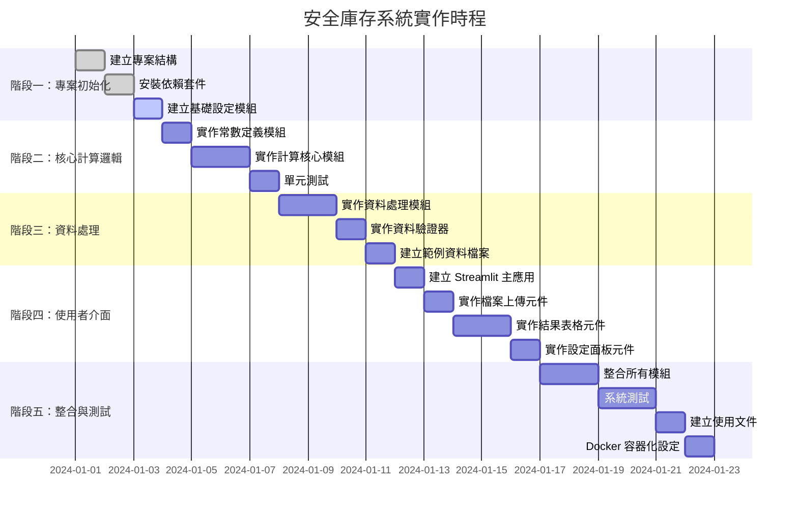

# 安全(緩衝)庫存計算機 - 實作計畫

## 實作階段總覽

本系統將分為 5 個主要實作階段，從基礎架構到完整功能交付。



## 階段一：專案初始化

### 1.1 建立專案目錄結構
- [ ] 建立所有必要的目錄（config/, core/, ui/, utils/, data/, tests/, docs/）
- [ ] 建立 `__init__.py` 檔案於所有 Python 套件目錄
- [ ] 建立 `.gitignore` 檔案（排除 Python 快取、虛擬環境等）

### 1.2 安裝依賴套件
- [ ] 建立 `requirements.txt` 檔案，包含以下套件：
  - `streamlit>=1.28.0`
  - `pandas>=2.0.0`
  - `numpy>=1.24.0`
  - `openpyxl>=3.1.0`（Excel 支援）
  - `pytest>=7.4.0`（測試框架）
  - `pytest-cov>=4.1.0`（測試覆蓋率）
- [ ] 建立虛擬環境（建議使用 venv 或 conda）
- [ ] 安裝所有依賴套件

### 1.3 建立基礎設定模組
- [ ] 建立 [`config/settings.py`](config/settings.py:1)
- [ ] 實作 `Settings` 類別，包含以下屬性：
  - `max_safety_stock_days`（預設 14，範圍 7-14）
  - `moq_multiplier`（預設 1.25）
  - `moq_constraint_mode`（"multiplier" 或 "add_one"）
- [ ] 實作設定儲存和載入功能（JSON 格式）
- [ ] 實作按 Shop Class 設定天數上限的功能（擴展功能）

## 階段二：核心計算邏輯

### 2.1 實作常數定義模組
- [ ] 建立 [`core/constants.py`](core/constants.py:1)
- [ ] 定義 MF（合併因素）對照表字典：
  ```python
  MF_TABLE = {
      "AA": {"value": 2.58, "service_level": "99.5%"},
      "A1": {"value": 2.33, "service_level": "99.0%"},
      "A2": {"value": 2.05, "service_level": "98.0%"},
      "A3": {"value": 1.88, "service_level": "97.0%"},
      "B1": {"value": 1.75, "service_level": "96.0%"},
      "B2": {"value": 1.645, "service_level": "95.0%"},
      "C1": {"value": 1.555, "service_level": "94.0%"},
      "C2": {"value": 1.48, "service_level": "93.0%"},
      "D1": {"value": 1.28, "service_level": "90.0%"}
  }
  ```
- [ ] 定義 Supply Source 對應的前置時間表：
  ```python
  LEAD_TIME_MAP = {
      "1": 7,   # 行貨
      "2": 3,   # 倉貨
      "4": 7    # 行貨
  }
  DEFAULT_LEAD_TIME = 7
  ```
- [ ] 定義其他常數（如預設天數上限範圍等）

### 2.2 實作計算核心模組
- [ ] 建立 [`core/calculator.py`](core/calculator.py:1)
- [ ] 實作 `SafetyStockCalculator` 類別
- [ ] 實作以下方法：

#### 2.2.1 計算平均日銷量
```python
def calculate_avg_daily_sales(last_month_qty: float, last_2_month_qty: float) -> float:
    """
    計算平均日銷量，保留 2 位小數
    公式：Avg_Daily_Sales = (Last Month Sold Qty + Last 2 Month Sold Qty) / 60
    """
```

#### 2.2.2 判斷前置時間
```python
def determine_lead_time(supply_source: str) -> int:
    """
    依 Supply Source 判斷前置時間
    - "1" 或 "4" → 7 天（行貨）
    - "2" → 3 天（倉貨）
    - 其他 → 預設 7 天
    """
```

#### 2.2.3 取得合併因素
```python
def get_merge_factor(shop_class: str) -> dict:
    """
    依 Shop Class 取得合併因素 MF
    返回包含 value 和 service_level 的字典
    """
```

#### 2.2.4 計算初步安全庫存
```python
def calculate_preliminary_ss(avg_daily_sales: float, lead_time: int, mf: float) -> float:
    """
    計算初步安全庫存
    公式：SS_preliminary = Avg_Daily_Sales × √Lead_Time_Days × MF
    """
```

#### 2.2.5 套用 MOQ 約束
```python
def apply_moq_constraint(
    preliminary_ss: float, 
    moq: float, 
    multiplier: float, 
    mode: str
) -> tuple:
    """
    套用 MOQ 約束（最高優先）
    - 乘數模式：Suggested_SS = max(SS_preliminary, MOQ × multiplier)
    - 加 1 模式：Suggested_SS = max(SS_preliminary, MOQ + 1)
    返回：(SS_after_MOQ, moq_constraint_applied)
    """
```

#### 2.2.6 套用天數上限
```python
def apply_max_days_constraint(
    ss_after_moq: float, 
    avg_daily_sales: float, 
    max_days: int
) -> tuple:
    """
    套用使用者設定的天數上限
    公式：Max_Allowed_SS = Avg_Daily_Sales × User_Max_Days
    返回：(Suggested_Safety_Stock, max_days_constraint_applied)
    """
```

#### 2.2.7 計算最終支撐天數
```python
def calculate_safety_stock_days(suggested_ss: float, avg_daily_sales: float) -> float:
    """
    計算最終安全庫存可支撐的天數
    公式：Safety_Stock_Days = Suggested_Safety_Stock / Avg_Daily_Sales
    """
```

#### 2.2.8 主要計算方法
```python
def calculate_safety_stock(
    article: str,
    site: str,
    shop_class: str,
    last_month_qty: float,
    last_2_month_qty: float,
    supply_source: str,
    moq: float,
    settings: Settings
) -> dict:
    """
    執行完整的安全庫存計算流程
    返回包含所有中間結果和最終結果的字典
    """
```

### 2.3 單元測試
- [ ] 建立 [`tests/test_calculator.py`](tests/test_calculator.py:1)
- [ ] 測試 `calculate_avg_daily_sales()` 方法
- [ ] 測試 `determine_lead_time()` 方法（包含邊界情況）
- [ ] 測試 `get_merge_factor()` 方法（包含無效 Shop Class）
- [ ] 測試 `calculate_preliminary_ss()` 方法
- [ ] 測試 `apply_moq_constraint()` 方法（兩種模式）
- [ ] 測試 `apply_max_days_constraint()` 方法
- [ ] 測試完整計算流程（端到端測試）
- [ ] 確保測試覆蓋率達到 80% 以上

## 階段三：資料處理

### 3.1 實作資料處理模組
- [ ] 建立 [`core/data_processor.py`](core/data_processor.py:1)
- [ ] 實作 `DataProcessor` 類別
- [ ] 實作以下方法：

#### 3.1.1 載入資料檔案
```python
def load_data(file_path: str) -> pd.DataFrame:
    """
    載入 CSV 或 Excel 檔案
    自動偵測檔案格式並使用適當的 pandas 方法載入
    """
```

#### 3.1.2 驗證必要欄位
```python
def validate_required_columns(df: pd.DataFrame) -> bool:
    """
    驗證資料是否包含所有必要欄位：
    - Article
    - Site
    - Class
    - Last Month Sold Qty
    - Last 2 Month Sold Qty
    - Supply Source
    - MOQ
    """
```

#### 3.1.3 清洗資料
```python
def clean_data(df: pd.DataFrame) -> pd.DataFrame:
    """
    清洗資料：
    - 移除空值
    - 轉換資料類型
    - 處理異常值
    """
```

#### 3.1.4 準備計算資料
```python
def prepare_calculation_data(df: pd.DataFrame) -> list:
    """
    將 DataFrame 轉換為計算所需的格式
    返回字典列表，每個字典代表一筆記錄
    """
```

### 3.2 實作資料驗證器
- [ ] 建立 [`utils/validators.py`](utils/validators.py:1)
- [ ] 實作以下驗證函數：

#### 3.2.1 驗證數值欄位
```python
def validate_numeric_value(value, field_name: str, min_value: float = 0) -> tuple:
    """
    驗證數值欄位是否有效
    返回：(is_valid, error_message)
    """
```

#### 3.2.2 驗證 Shop Class
```python
def validate_shop_class(shop_class: str) -> tuple:
    """
    驗證 Shop Class 是否在有效範圍內
    有效值：AA, A1, A2, A3, B1, B2, C1, C2, D1
    返回：(is_valid, error_message)
    """
```

#### 3.2.3 驗證 Supply Source
```python
def validate_supply_source(supply_source: str) -> tuple:
    """
    驗證 Supply Source 格式
    返回：(is_valid, error_message)
    """
```

#### 3.2.4 驗證設定參數
```python
def validate_settings(settings: Settings) -> tuple:
    """
    驗證使用者設定是否在有效範圍內
    - max_safety_stock_days: 7-14
    - moq_multiplier: > 0
    - moq_constraint_mode: "multiplier" 或 "add_one"
    返回：(is_valid, error_message)
    """
```

### 3.3 建立範例資料檔案
- [ ] 建立 [`data/input/sample_input.csv`](data/input/sample_input.csv:1)
- [ ] 包含多種測試案例：
  - 不同 Shop Class 的記錄
  - 不同 Supply Source 的記錄
  - 觸發 MOQ 約束的記錄
  - 觸發天數上限的記錄
  - 正常計算的記錄
- [ ] 建立 [`data/input/sample_input.xlsx`](data/input/sample_input.xlsx:1)（Excel 版本）

### 3.4 資料處理測試
- [ ] 建立 [`tests/test_data_processor.py`](tests/test_data_processor.py:1)
- [ ] 測試資料載入功能（CSV 和 Excel）
- [ ] 測試欄位驗證功能
- [ ] 測試資料清洗功能
- [ ] 測試異常情況處理

## 階段四：使用者介面

### 4.1 建立 Streamlit 主應用
- [ ] 建立 [`app.py`](app.py:1)
- [ ] 設定 Streamlit 應用程式基本配置：
  ```python
  st.set_page_config(
      page_title="安全(緩衝)庫存計算機",
      page_icon="📦",
      layout="wide"
  )
  ```
- [ ] 實作頁面導航（側邊欄）
- [ ] 實作首頁（系統簡介和使用說明）

### 4.2 實作檔案上傳元件
- [ ] 建立 [`ui/components/file_uploader.py`](ui/components/file_uploader.py:1)
- [ ] 實作檔案上傳介面：
  - 支援 CSV 和 Excel 檔案
  - 顯示上傳的檔案資訊
  - 提供檔案預覽功能
- [ ] 實作檔案驗證和錯誤提示

### 4.3 實作結果表格元件
- [ ] 建立 [`ui/components/results_table.py`](ui/components/results_table.py:1)
- [ ] 實作結果表格展示：
  - 顯示所有輸出欄位
  - 支援排序和篩選
  - 高亮顯示觸發約束的記錄
  - 顯示計算過程（可展開/收起）
- [ ] 實作統計摘要：
  - 總記錄數
  - 觸發 MOQ 約束的記錄數
  - 觸發天數上限的記錄數
  - 平均安全庫存天數

### 4.4 實作設定面板元件
- [ ] 建立 [`ui/components/config_panel.py`](ui/components/config_panel.py:1)
- [ ] 實作設定調整介面：
  - 安全庫存天數上限（滑桿，範圍 7-14）
  - MOQ 約束乘數（數字輸入，預設 1.25）
  - MOQ 約束模式（下拉選單：乘數模式 / 加 1 模式）
  - 按 Shop Class 設定天數上限（擴展功能）
- [ ] 實作設定儲存和載入功能
- [ ] 實作設定匯入/匯出功能（JSON 格式）

### 4.5 實作計算頁面
- [ ] 建立 [`ui/pages/calculate.py`](ui/pages/calculate.py:1)
- [ ] 整合檔案上傳、設定面板和結果表格
- [ ] 實作計算按鈕和進度指示器
- [ ] 實作錯誤處理和提示訊息

### 4.6 實作設定頁面
- [ ] 建立 [`ui/pages/settings.py`](ui/pages/settings.py:1)
- [ ] 提供詳細的設定介面
- [ ] 提供設定說明和建議值

### 4.7 實作匯出功能
- [ ] 建立 [`utils/exporters.py`](utils/exporters.py:1)
- [ ] 實作 Excel 匯出功能：
  ```python
  def export_to_excel(data: pd.DataFrame, output_path: str) -> None:
      """
      將計算結果匯出為 Excel 檔案
      包含多個工作表：結果、統計摘要、設定
      """
  ```
- [ ] 實作 CSV 匯出功能
- [ ] 在 UI 中提供下載按鈕

## 階段五：整合與測試

### 5.1 整合所有模組
- [ ] 將計算核心、資料處理和 UI 模組整合
- [ ] 確保模組間的資料流正確
- [ ] 測試完整的使用者流程

### 5.2 系統測試
- [ ] 功能測試：
  - [ ] 測試檔案上傳功能
  - [ ] 測試計算功能（各種情況）
  - [ ] 測試設定調整功能
  - [ ] 測試匯出功能
- [ ] 邊界測試：
  - [ ] 測試空資料集
  - [ ] 測試極大資料集（效能測試）
  - [ ] 測試無效資料格式
  - [ ] 測試極端數值（如 MOQ = 0）
- [ ] 使用者體驗測試：
  - [ ] 測試介面響應速度
  - [ ] 測試錯誤訊息清晰度
  - [ ] 測試操作流程直觀性

### 5.3 建立使用文件
- [ ] 建立 [`README.md`](README.md:1)
  - 專案簡介
  - 功能特色
  - 安裝說明
  - 使用指南
  - 常見問題
- [ ] 建立 [`docs/USER_GUIDE.md`](docs/USER_GUIDE.md:1)
  - 詳細使用說明
  - 檔案格式要求
  - 計算公式說明
  - 設定參數說明
  - 範例和最佳實踐
- [ ] 建立 [`docs/API.md`](docs/API.md:1)
  - 核心模組 API 文件
  - 計算邏輯說明
  - 擴展開發指南

### 5.4 Docker 容器化設定
- [ ] 建立 [`Dockerfile`](Dockerfile:1)
  ```dockerfile
  FROM python:3.11-slim
  WORKDIR /app
  COPY requirements.txt .
  RUN pip install --no-cache-dir -r requirements.txt
  COPY . .
  EXPOSE 8501
  CMD ["streamlit", "run", "app.py", "--server.port=8501", "--server.address=0.0.0.0"]
  ```
- [ ] 建立 [`docker-compose.yml`](docker-compose.yml:1)
  ```yaml
  version: '3.8'
  services:
    safety-stock-app:
      build: .
      ports:
        - "8501:8501"
      volumes:
        - ./data:/app/data
  ```
- [ ] 測試 Docker 建置和運行

### 5.5 程式碼品質檢查
- [ ] 執行程式碼格式化（black）
- [ ] 執行程式碼檢查（flake8 或 pylint）
- [ ] 執行測試覆蓋率檢查
- [ ] 修復所有發現的問題

## 驗收標準

### 功能驗收
- [x] 能正確計算安全庫存建議值
- [x] 支援 CSV 和 Excel 檔案輸入
- [x] 能正確套用 MOQ 約束（兩種模式）
- [x] 能正確套用天數上限
- [x] 能顯示完整的計算過程和結果
- [x] 能匯出計算結果（Excel 和 CSV）
- [x] 能調整所有使用者設定參數

### 品質驗收
- [x] 單元測試覆蓋率 ≥ 80%
- [x] 無程式碼檢查錯誤或警告
- [x] 所有功能都有完整的錯誤處理
- [x] 使用者介面直觀易用
- [x] 文件完整且清晰

### 效能驗收
- [x] 能在 5 秒內處理 1000 筆記錄
- [x] 能在 30 秒內處理 10000 筆記錄
- [x] 介面響應時間 < 1 秒

## 後續改進建議

### 短期改進（v1.1）
- [ ] 支援按 Shop Class 設定不同的天數上限
- [ ] 加入計算歷史紀錄功能
- [ ] 提供更多匯出格式（PDF、JSON）
- [ ] 加入資料視覺化圖表

### 中期改進（v2.1）
- [ ] 引入銷量標準差計算
- [ ] 加入季節性/促銷調整係數
- [ ] 支援資料庫連接（MySQL、PostgreSQL）
- [ ] 加入排程自動計算功能

### 長期改進（v3.0）
- [ ] 結合現有庫存與在途量
- [ ] 支援多層級天數上限設定
- [ ] 加入機器學習模型預測銷量
- [ ] 提供多使用者權限管理
