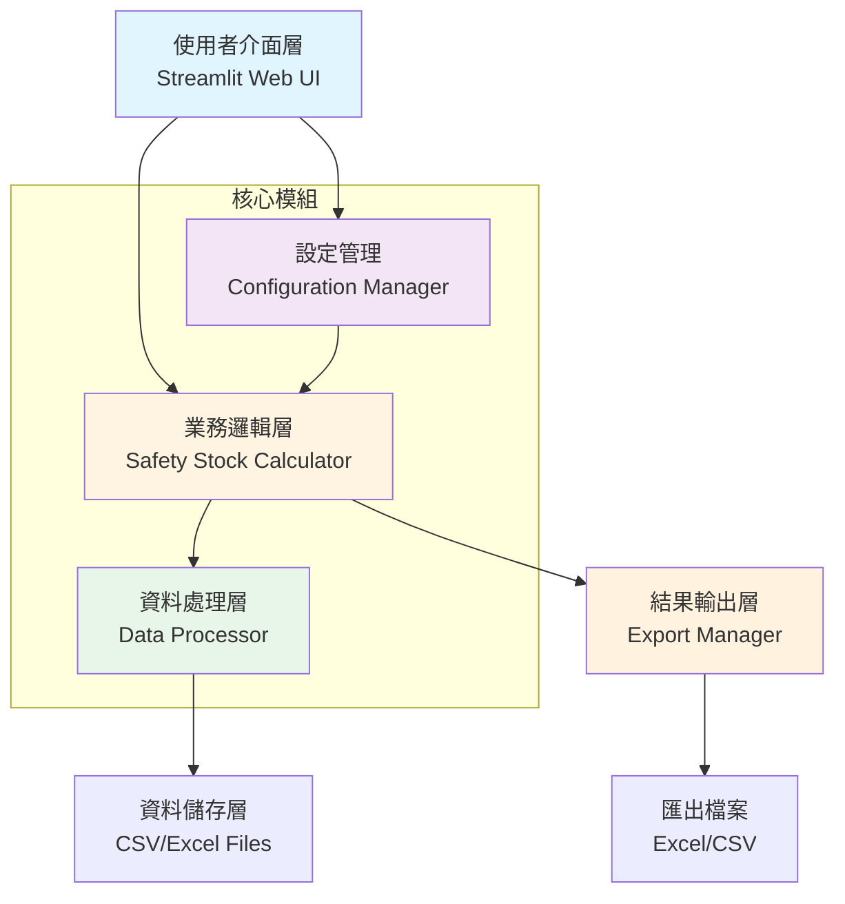
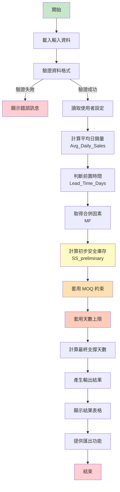
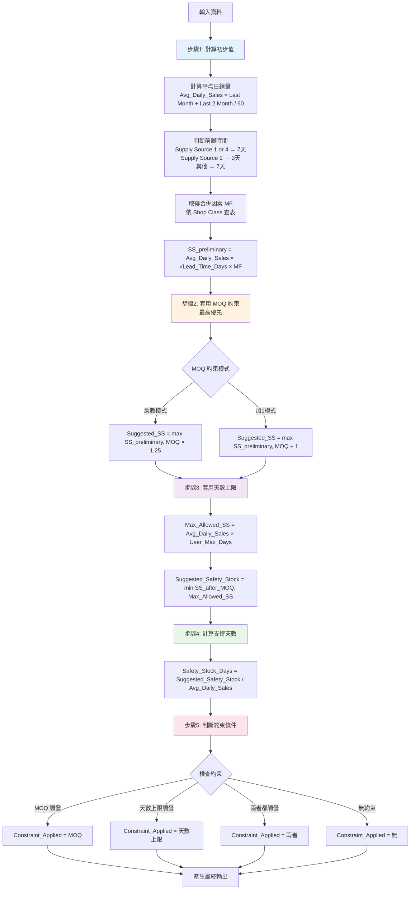
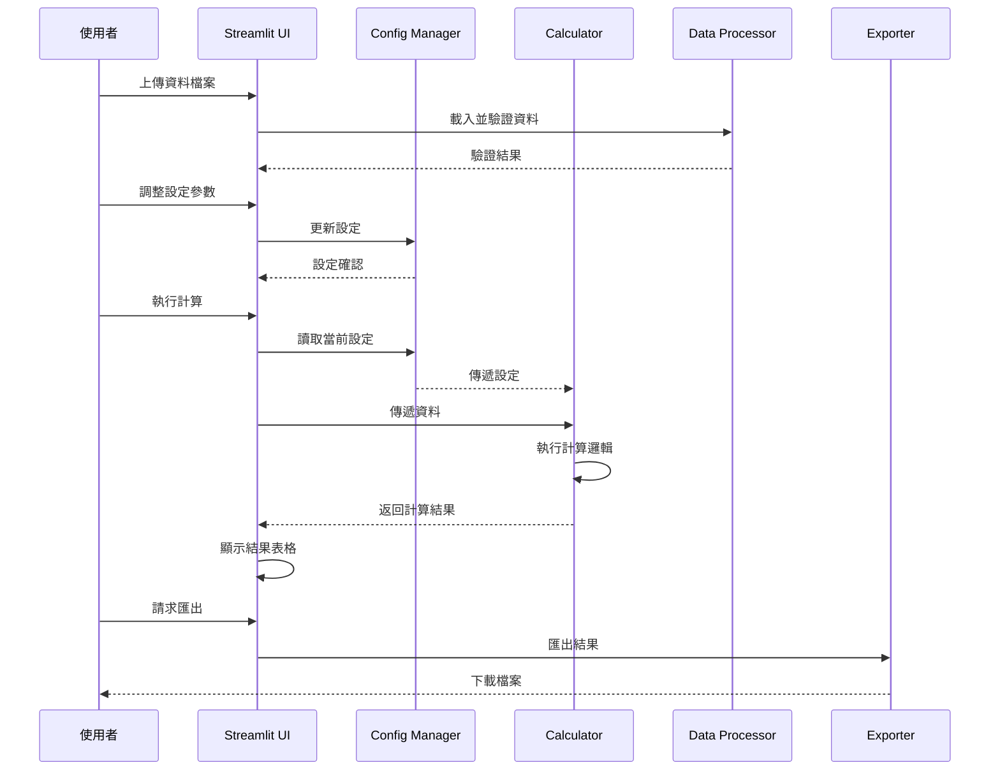

# 安全(緩衝)庫存計算機 - 系統架構設計

## 1. 系統概述

**系統名稱**: Safety(Buffer) Stock Calculation v1.0  
**技術堆疊**: Python + Streamlit  
**部署方式**: 本地運行 / Docker 容器化  
**資料輸入**: CSV/Excel 檔案上傳

## 2. 系統架構圖



## 3. 計算流程圖



## 4. 核心計算邏輯詳細流程



## 5. 專案目錄結構

```
Kilo Safety Stock Calculate/
├── app.py                          # Streamlit 主應用程式
├── requirements.txt                # Python 套件依賴
├── README.md                       # 專案說明文件
├── Dockerfile                      # Docker 容器化設定
├── docker-compose.yml              # Docker Compose 設定
├── config/
│   ├── __init__.py
│   └── settings.py                 # 系統設定管理
├── core/
│   ├── __init__.py
│   ├── calculator.py               # 核心計算邏輯
│   ├── data_processor.py           # 資料處理
│   └── constants.py               # 常數定義（MF 表等）
├── ui/
│   ├── __init__.py
│   ├── pages/
│   │   ├── home.py                 # 首頁
│   │   ├── calculate.py            # 計算頁面
│   │   └── settings.py             # 設定頁面
│   └── components/
│       ├── file_uploader.py        # 檔案上傳元件
│       ├── results_table.py        # 結果表格元件
│       └── config_panel.py         # 設定面板元件
├── utils/
│   ├── __init__.py
│   ├── validators.py               # 資料驗證
│   ├── exporters.py                # 匯出功能
│   └── helpers.py                  # 輔助函數
├── data/
│   ├── input/                      # 輸入資料範例
│   │   └── sample_input.csv
│   └── output/                     # 輸出資料目錄
├── tests/
│   ├── __init__.py
│   ├── test_calculator.py          # 計算邏輯測試
│   ├── test_data_processor.py      # 資料處理測試
│   └── test_validators.py          # 驗證測試
└── docs/
    ├── API.md                      # API 文件
    └── USER_GUIDE.md               # 使用者指南
```

## 6. 核心模組說明

### 6.1 設定管理模組 (config/settings.py)
- 管理使用者可配置的參數
- 支援全域設定和按 Shop Class 設定
- 儲存和載入設定

### 6.2 計算核心模組 (core/calculator.py)
- 實作完整的安全庫存計算邏輯
- 支援多種 MOQ 約束模式
- 記錄每個計算步驟的結果

### 6.3 資料處理模組 (core/data_processor.py)
- 載入和解析 CSV/Excel 檔案
- 資料清洗和格式轉換
- 資料驗證

### 6.4 常數定義模組 (core/constants.py)
- MF（合併因素）對照表
- Supply Source 對應的前置時間表
- 其他固定常數

### 6.5 使用者介面模組 (ui/)
- Streamlit 頁面和元件
- 檔案上傳功能
- 結果展示和互動

### 6.6 工具模組 (utils/)
- 資料驗證器
- Excel/CSV 匯出器
- 輔助函數

## 7. 資料流程



## 8. 技術選擇理由

### 8.1 為什麼選擇 Python + Streamlit？
- **快速開發**: Streamlit 提供簡潔的 API，可快速建立互動式 Web 應用
- **資料處理強大**: Python 的 pandas、numpy 套件非常適合資料分析
- **易於部署**: 支援 Docker 容器化，可輕鬆部署到各種環境
- **使用者友善**: 自動生成 UI，無需前端開發經驗

### 8.2 為什麼選擇 CSV/Excel 作為資料輸入格式？
- **通用性高**: 大多數企業系統都支援匯出這些格式
- **易於使用**: 使用者熟悉這些格式，無需額外培訓
- **靈活性**: 支援大量資料批次處理

### 8.3 為什麼選擇模組化架構？
- **可維護性**: 清晰的模組分離使程式碼易於理解和修改
- **可擴展性**: 未來可輕鬆添加新功能（如資料庫連接、API 整合等）
- **可測試性**: 每個模組可獨立測試，提高程式碼品質

## 9. 未來擴展方向

### 9.1 短期擴展（v1.1）
- 支援按 Shop Class 設定不同的天數上限
- 加入計算歷史紀錄功能
- 提供更多匯出格式（PDF、JSON）

### 9.2 中期擴展（v2.1）
- 引入銷量標準差計算，升級為完整統計模型
- 加入季節性/促銷調整係數
- 支援資料庫連接（MySQL、PostgreSQL）

### 9.3 長期擴展（v3.0）
- 結合現有庫存與在途量，產出建議訂貨量
- 支援多層級天數上限設定
- 加入機器學習模型預測銷量
- 提供多使用者權限管理
- 支援排程自動計算

## 10. 風險與挑戰

### 10.1 技術風險
- **資料品質**: 輸入資料可能有缺失或錯誤，需要完善的驗證機制
- **效能問題**: 大量資料計算可能影響效能，需要優化計算邏輯

### 10.2 業務風險
- **參數調整**: MF 值和 MOQ 乘數需要根據實際業務調整
- **使用者接受度**: 需要提供清晰的使用說明和範例

### 10.3 緩解措施
- 實作完整的資料驗證和錯誤處理
- 提供詳細的使用者指南和範例資料
- 支援設定匯入/匯出，方便參數管理
