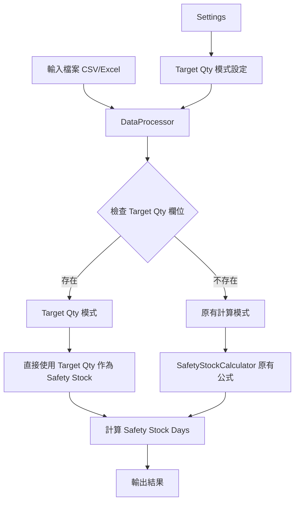

# Target Qty 功能實施計劃

## 需求概述

優化系統以支援按未來一個月的銷售預測（Target Qty）來計算 Safety Stock。

### 核心需求
1. **輸入方式**：在現有輸入檔案中新增「Target Qty」欄位，每個 SKU-Site 組合都有預測值
2. **計算邏輯**：如果 Target Qty 存在，直接使用 Target Qty 作為 Safety Stock（跳過原有計算）
3. **優先順序**：Target Qty 優先於原有的安全庫存計算公式

## 系統架構圖

## 實施步驟

### 1. 更新 core/constants.py
新增 Target Qty 相關常數：
- `FIELD_TARGET_QTY = "Target Qty"`
- 新增欄位名稱映射別名

### 2. 更新 core/data_processor.py
- 在 `normalize_column_names()` 中新增 Target Qty 欄位映射
- 在 `prepare_calculation_data()` 中新增 Target Qty 欄位處理
- 更新 `clean_data()` 以處理 Target Qty 數值

### 3. 更新 core/calculator.py
修改 `SafetyStockCalculator` 類別：
- 新增 `calculate_safety_stock_with_target_qty()` 方法
- 修改 `calculate_safety_stock()` 方法以檢查 Target Qty
- 當 Target Qty 存在時，直接使用 Target Qty 作為 Safety Stock
- 計算對應的 Safety Stock Days

### 4. 更新 config/settings.py
新增 Target Qty 模式設定：
- `use_target_qty_mode: bool = False` - 是否啟用 Target Qty 模式
- 新增驗證邏輯

### 5. 更新 app.py
新增 Target Qty 模式切換 UI：
- 在側邊欄新增「Target Qty 模式」選項
- 當啟用 Target Qty 模式時，檢查資料是否包含 Target Qty 欄位
- 顯示相應的提示訊息

### 6. 更新樣本輸入檔案
在 `data/input/sample_input.csv` 中新增 Target Qty 欄位範例

### 7. 更新輸出欄位
在結果中新增：
- `Target_Qty_Used` - 是否使用了 Target Qty
- `Calculation_Mode` - 計算模式（"Target Qty" 或 "Standard"）

## 計算邏輯詳細說明

### Target Qty 模式
當 Target Qty 存在且 Target Qty 模式啟用時：

1. **Safety Stock** = Target Qty
2. **Safety Stock Days** = Target Qty / Avg_Daily_Sales
3. **Constraint Applied** = "Target Qty"
4. **跳過**原有的計算步驟（MF、MOQ 約束、天數上限）

### 標準模式
當 Target Qty 不存在或 Target Qty 模式未啟用時：

1. 使用原有的完整計算公式
2. 計算初步安全庫存
3. 套用 MOQ 約束
4. 套用天數上限

## 欄位變更摘要

### 輸入欄位（新增）
| 欄位名稱 | 類型 | 必填 | 說明 |
|---------|------|------|------|
| Target Qty | 數字 | 否 | 未來一個月的預測 Safety Stock |

### 輸出欄位（新增）
| 欄位名稱 | 說明 |
|---------|------|
| Target_Qty_Used | 是否使用了 Target Qty（True/False） |
| Calculation_Mode | 計算模式（"Target Qty" 或 "Standard"） |

## 向後兼容性
- Target Qty 欄位為可選欄位
- 如果 Target Qty 不存在，系統會使用原有的計算公式
- 現有的輸入檔案不需要修改即可繼續使用

## 測試計劃
1. 測試 Target Qty 存在時的計算邏輯
2. 測試 Target Qty 不存在時的計算邏輯
3. 測試 Target Qty 模式切換功能
4. 測試輸出欄位正確性
5. 測試向後兼容性

## 注意事項
- Target Qty 應為非負數
- 如果 Avg_Daily_Sales 為 0，Safety Stock Days 應設為 0
- Target Qty 模式優先於所有其他計算邏輯
