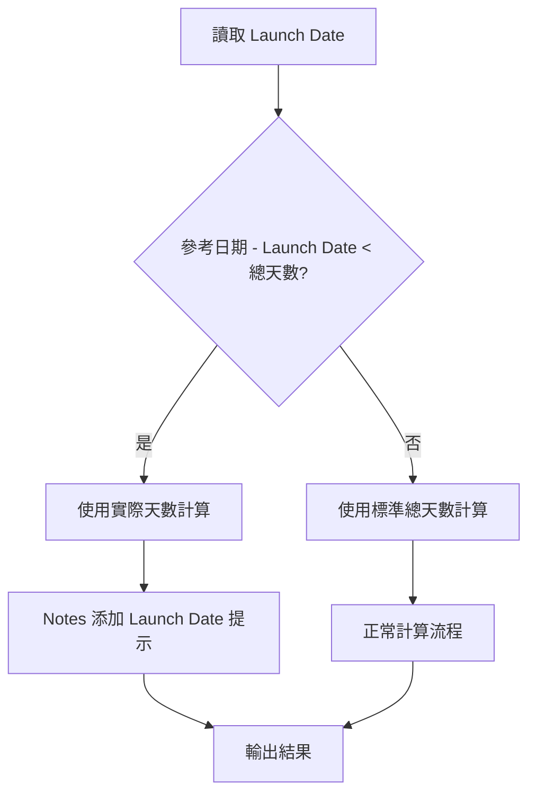

# V2.2 Launch Date 功能實施計劃

## 需求摘要

當 **Launch Date 到參考日期的天數** 少於 **(Last 2 month Days + Last Month Days + MTD Days)** 總和時：
- 只計算 Launch Date 到參考日期的實際天數來計算平均日銷量
- 在 Notes 欄位顯示提示訊息："Launch Date 影響計算, 只計算Launch Date到參考日期的實際天數"

## 邏輯流程



## 需要修改的檔案

### 1. core/constants.py
- 新增 `FIELD_LAUNCH_DATE = "Launch Date"` 常數
- 新增 COLUMN_NAME_ALIASES 映射

### 2. core/data_processor.py
- 在 prepare_calculation_data 中加入 Launch Date 欄位處理
- 新增可選欄位檢查

### 3. core/calculator.py
- 修改 `calculate_avg_daily_sales_with_date` 方法，加入 Launch Date 參數
- 新增邏輯：計算 days_since_launch = 參考日期 - Launch Date
- 比較 days_since_launch 與 total_days (mtd_days + last_month_days + last_2_month_days)
- 如果 days_since_launch < total_days，則使用 days_since_launch 作為計算天數
- 返回標記表示是否受 Launch Date 影響
- 修改 `calculate_safety_stock` 方法，傳入 Launch Date 參數
- 在 Notes 中加入 Launch Date 影響提示

### 4. app.py
- 在 calculate_safety_stock 函數中傳入 launch_date 參數

## 計算公式

### 標準情況（Launch Date 足夠早）
```
Avg_Daily_Sales = (MTD_Qty + Last_Month_Qty + Last_2_Month_Qty) / (MTD_Days + Last_Month_Days + Last_2_Month_Days)
```

### Launch Date 影響情況
```
days_since_launch = 參考日期 - Launch Date
Avg_Daily_Sales = (MTD_Qty + Last_Month_Qty + Last_2_Month_Qty) / days_since_launch
```

## 實施步驟

1. [x] 分析 Launch Date 需求與現有代碼結構
2. [x] 更新 core/constants.py - 添加 Launch Date 欄位常數
3. [x] 更新 core/data_processor.py - 處理 Launch Date 欄位映射與數據準備
4. [x] 更新 core/calculator.py - 修改日期感知計算邏輯
5. [x] 新增 Launch Date 計算方法
6. [x] 更新 calculate_safety_stock 方法傳入 Launch Date 參數
7. [x] 在 Notes 中加入 Launch Date 影響提示
8. [x] 測試驗證功能正確性

## 修改摘要

### core/constants.py
- 新增 `FIELD_LAUNCH_DATE = "Launch Date"` 常數
- 新增 COLUMN_NAME_ALIASES 映射

### core/data_processor.py
- 在 clean_data 中新增 Launch Date 欄位轉換為日期格式
- 在 prepare_calculation_data 中加入 Launch Date 欄位處理

### core/calculator.py
- 修改 `calculate_avg_daily_sales_with_date` 方法，加入 Launch Date 參數和返回值
- 返回值改為 Tuple[float, bool] (平均日銷量, 是否受 Launch Date 影響)
- 新增 Launch Date 到參考日期的天數計算邏輯
- 修改 `calculate_safety_stock` 方法，傳入 Launch Date 參數
- 在 Notes 中加入 Launch Date 影響提示

### app.py
- 在 calculate_safety_stock 函數調用中傳入 launch_date 參數
